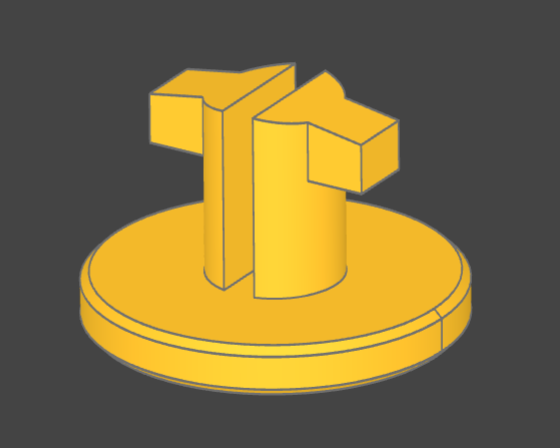
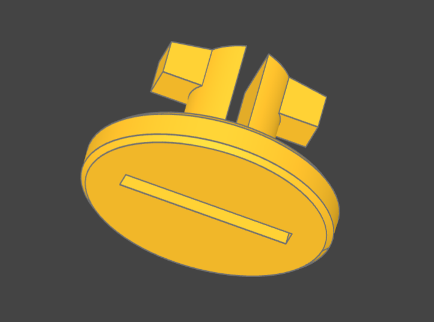
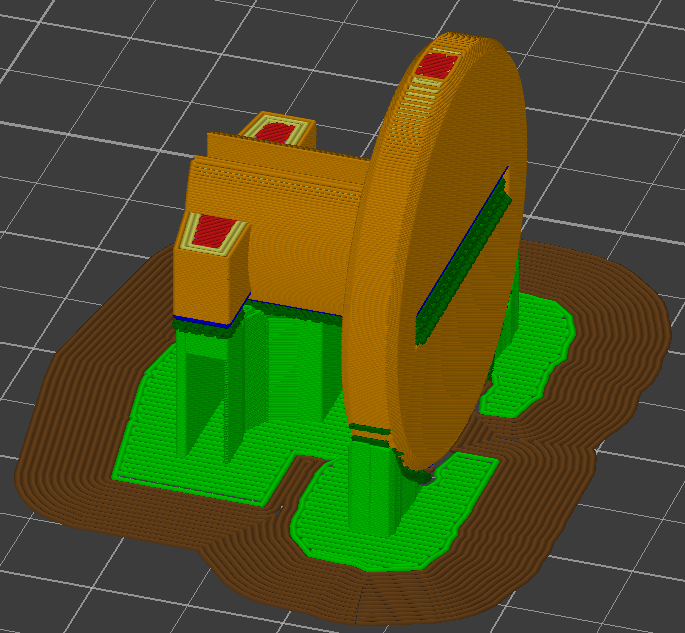

# Motorbike Helmet Clip

A helmet clip for a motorbike helmet visor. Modeled in CadQUERY and parametricly deisgned.

## Install

First setup a venv:

    mkdir /path/to/project
    cd /path/to/project
    python -m venv ./venv

Now step into venv:

    source ./venv/bin/activate

Next install cadquery:

    pip install cadquery

You are good to go!

## VSCode Preview

If you want to preview this design in VSCode, you will need to also install and configure OCP CAD Viewer:

https://marketplace.visualstudio.com/items?itemName=bernhard-42.ocp-cad-viewer

## Printing Tips

I printed this at 90 degrees (using supports), so that the layers are strongest along the stalks of the clip.
This could be printed as it is orientated, but this will introduce weekness where the stalks bend.

## How to customise the clip

All parameters are added to the top of the script. If you want export a custom sized clip, you just need to change the params and re-run the script.